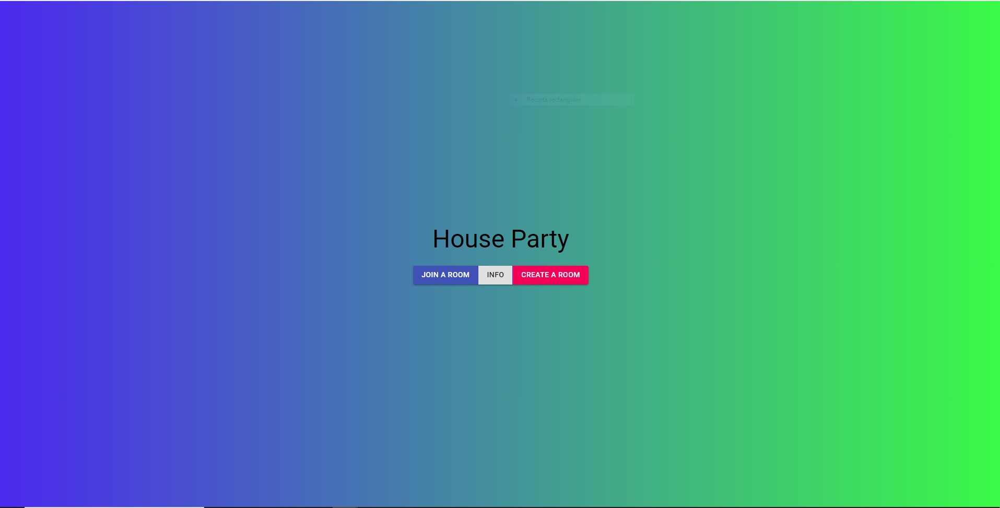
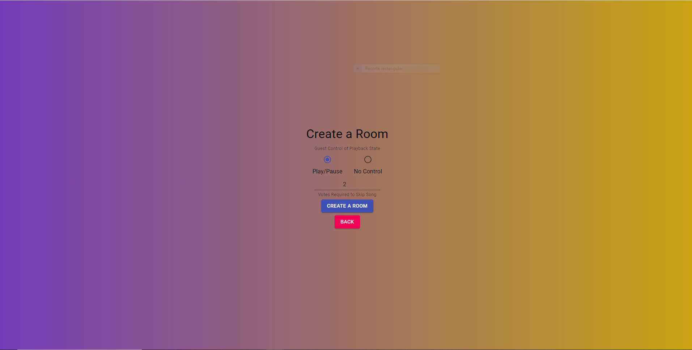

# House Party

House Party is a full stack Web Application developed using Django and React.js that showcases a Music Player using Spotify API.

[](http://www.youtube.com/watch?v=vE4lzrD1LM0 "House Party")

## Setup

```sh
git clone https://github.com/vicentefb/House-Party.git
cd House-Party\music_controller
python .\manage.py runserver
```

In a new terminal 
```sh
cd House-Party\music_controller\frontend
npm install
npm run dev
```

### Tech

Following the MVC (Model, View, Controller) pattern, Mybrary uses some open source projects to work properly:

* [Django] - High-level Python Web framework
* [React.js] - JavaScript library for building user interfaces
* [Spotify] - Spotify API


   [Django]: <https://www.djangoproject.com/>
   [React.js]: <https://reactjs.org/>
   [Spotify]: <https://developer.spotify.com/>

### Showcase



